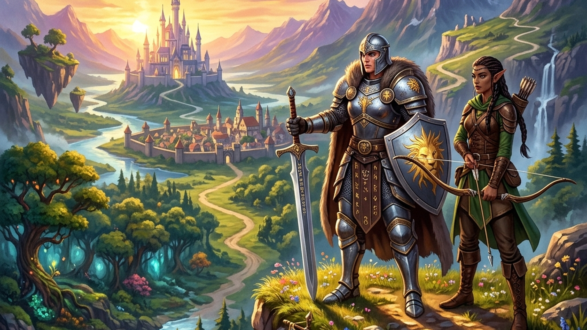
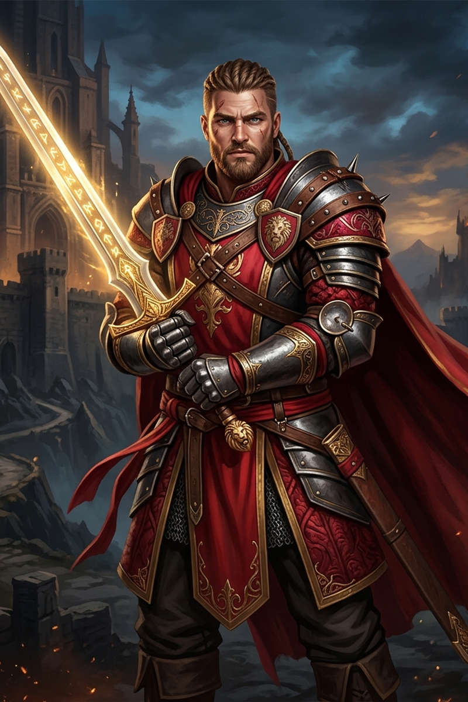
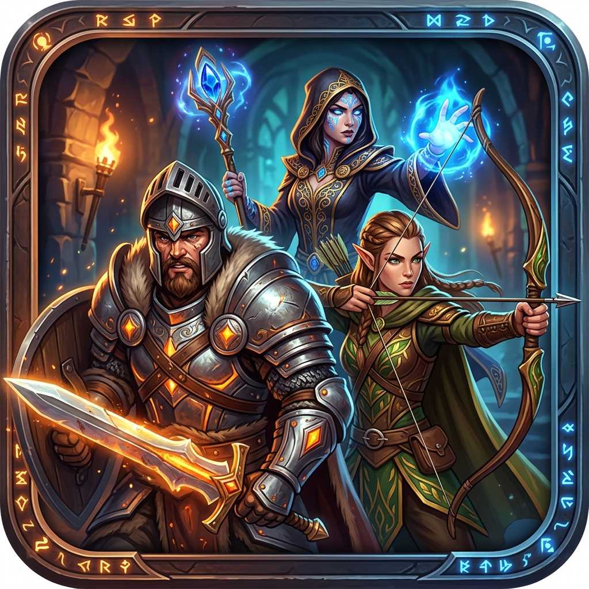
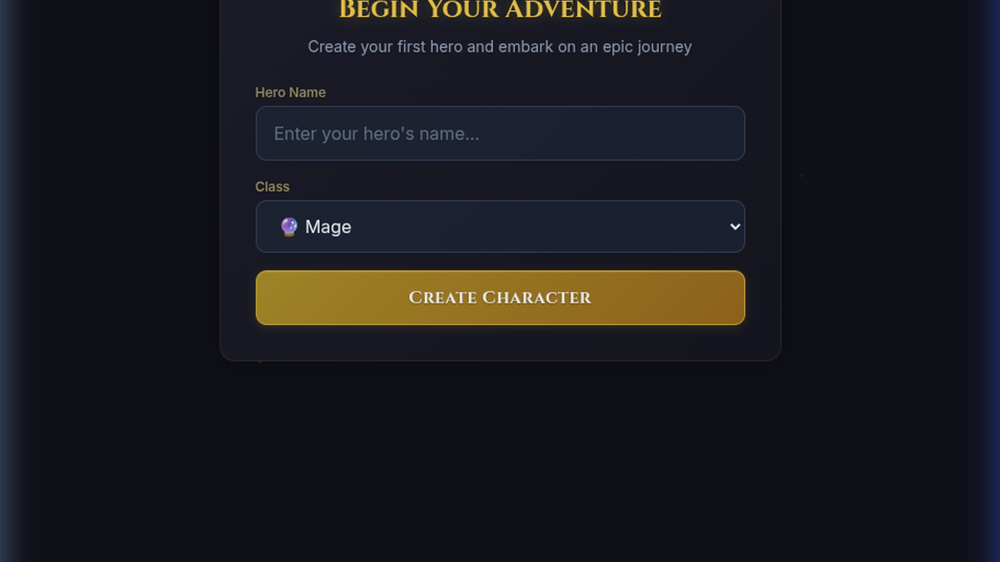

# VibeRPG

A classic turn-based RPG set in a vibe coded world. Built with React and designed for quick, vibey gameplay.

## High-Level Architecture

VibeRPG is structured as a single-page application (SPA). The architecture focuses on a fast, client-side first experience where most of the logic lives in the frontend:

- **Frontend UI**: Built with React and Vite. Tailwind CSS handles the styling, while Framer Motion is used for smooth UI transitions and micro-animations.
- **State & Data Persistence**: Active game state is persisted locally using **localStorage**.
- **Game Engine**: Turn-based combat, quest progression, and shop systems are driven by client-side data modules. 

*Note: This architecture is deliberately high-level and modular. As the game scales, the data layer can easily be abstracted to connect to a remote backend server and database.*

## Visual Preview

<div align="center">
  
  <div style="display: flex; gap: 10px; justify-content: center; margin-top: 10px;">
    
    
  </div>
</div>

### Character Creation & Arrival

<div align="center">
  
  <p><i>Start your journey by choosing your class and naming your hero.</i></p>
</div>

### Gameplay In Action
[View Gameplay Demo Video (MP4)](demo/demo.mp4)

## About the Game

Step into the Northern Lands as a Mage, Warrior, or Priest. Accept quests, battle monsters, and collect legendary equipment!

### Core Mechanics
- **Classes**: Choose between Mage, Warrior, or Priest. Each class has different base stats and starter equipment.
- **Quests & Battles**: Take on quests to face off against different enemies in classic turn-based combat. You can attack, defend, use spells, or flee.
- **Inventory & Shop**: Collect loot from battles or spend your hard-earned gold at the Shop. You can equip weapons, armor, hats, and boots to boost your stats, or buy food for your Bag to consume and restore HP/MP.
- **Progression**: Earn XP and Gold from successful encounters to level up your character naturally over time.

## Running Locally

To run the game on your local machine:

```bash
# Install dependencies
npm install

# Start the development server
npm run dev
```
